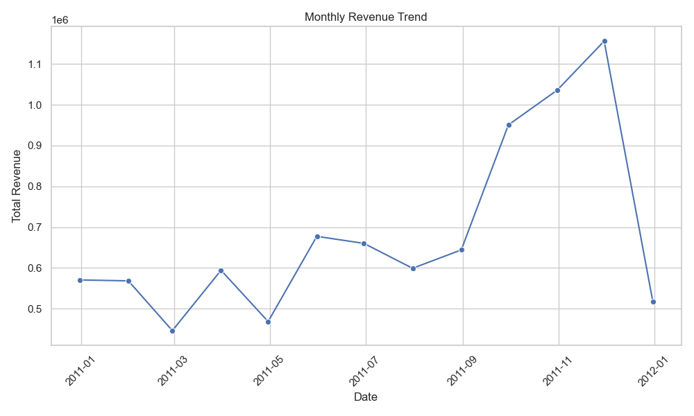
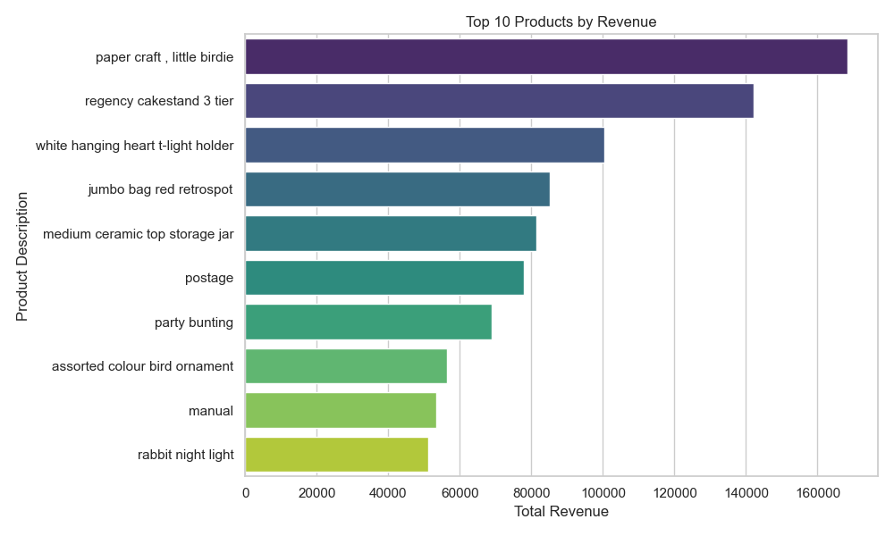
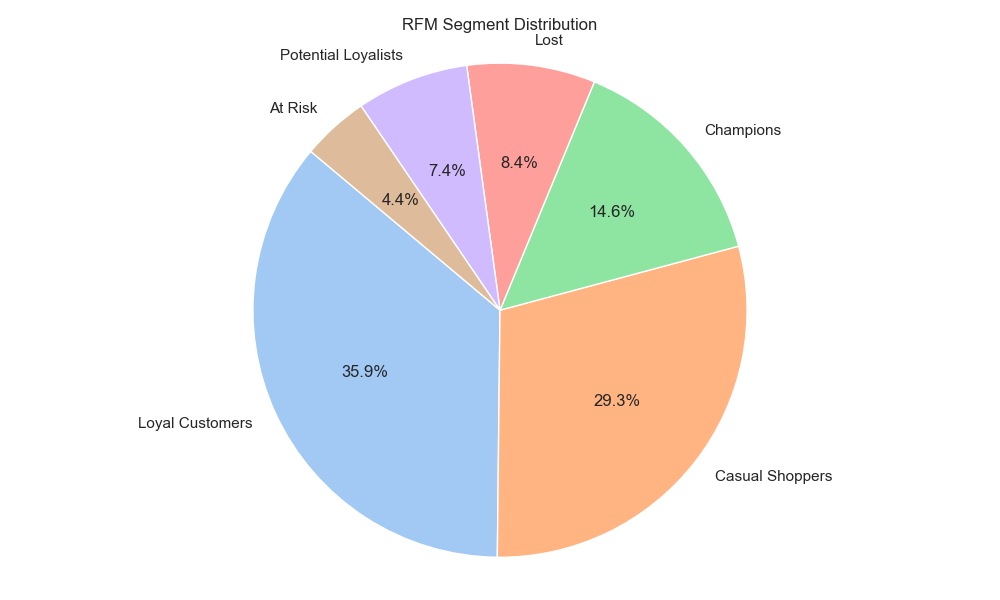
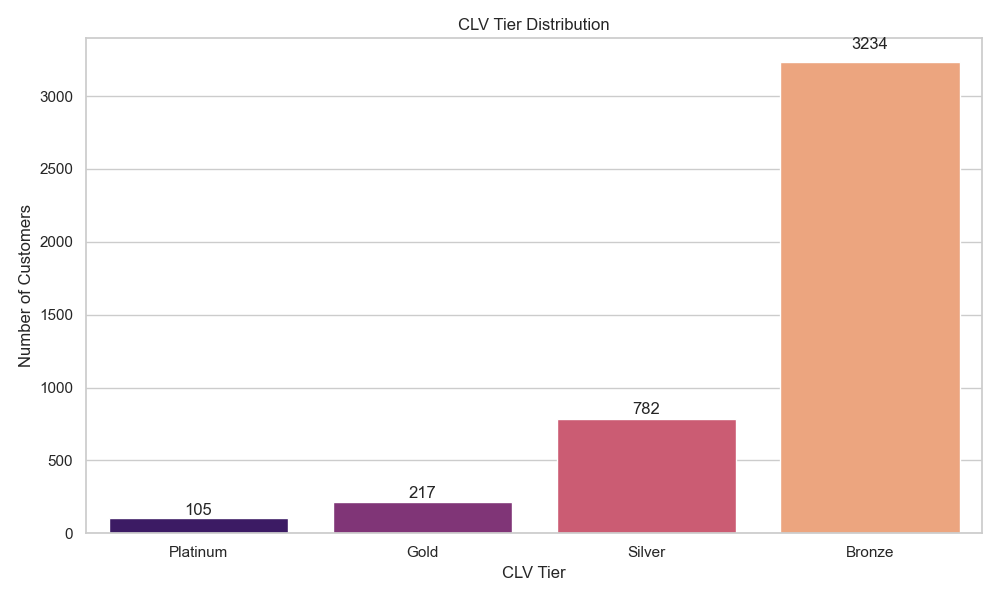
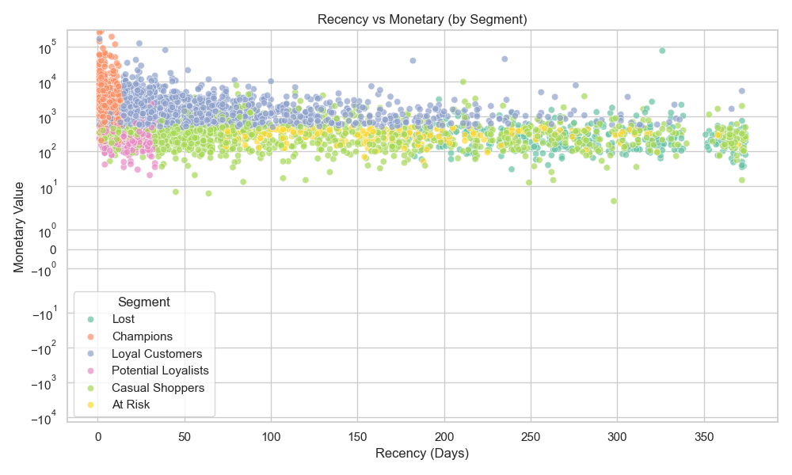
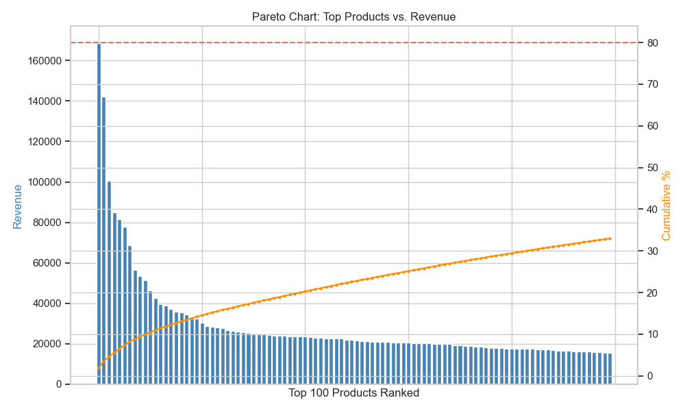

# E-Commerce Analytics & Customer Intelligence Platform

An end-to-end data analytics platform built on a real UK e-commerce dataset. Goes beyond basic charts to actually answer business questions - which customers are valuable, which are slipping away, and what their future spend might look like.

The platform supports:
- Automated data cleaning and SQL based storage
- Business performance tracking via SQL queries
- RFM segmentation (Recency, Frequency, Monetary)
- CLV prediction (Customer Lifetime Value) with model comparison
- Professional data visualization charts

Built with a sequential data pipeline architecture and robust analytic logic.

---

## Quick Start

```bash
python3 01_project_setup.py
python3 02_data_cleaning.py
python3 03_sql_queries.py
python3 04_rfm_scoring.py
python3 05_clv_prediction.py
python3 06_visualisations.py
```

---

## Architecture

The system follows a sequential data pipeline pattern:

**Data Engineering**
Cleans raw CSVs and sets up the relational database. Handles null IDs, cancelled orders, negative quantities, and date formatting.
Output: `cleaned_online_retail.csv`, `ecommerce_analytics.db`

**Analytics & Segmentation**
Extracts business metrics and scores customers. Runs queries for peak times, revenue trends, country-wise orders, and repeat vs new customer split.
Output: SQL query results, `rfm_data.csv` with customer buckets (Champions, At Risk, etc.)

**Machine Learning**
Trains and compares two models — a baseline Linear Regression and an optimised Gradient Boosting Regressor — to predict lifetime value, then uses KMeans to categorise customers into tiers (Platinum, Gold, Silver, Bronze).
Output: `clv_data.csv`

**Visualisation**
Generates six clean, professional static charts.
Output: `.png` files for monthly trends, Pareto analysis, segment distribution, CLV tiers, recency vs monetary scatter, and more.

---

## Setup

### Prerequisites
- Python 3.8+
- Git

### 1. Clone the Repository

```bash
git clone https://github.com/jayeshkaushik1/Retail-Customer-Analytics.git
cd Retail-Customer-Analytics
```

### 2. Install Dependencies

```bash
pip install -r requirements.txt
```

### 3. Download the Dataset

The dataset is included directly in the repository. Download it using Git:

```bash
# If not already cloned with the dataset, pull it explicitly
git lfs pull
```

Or download the raw file directly from GitHub:

```bash
curl -L -o online_retail.csv \
  "https://raw.githubusercontent.com/jayeshkaushik1/Retail-Customer-Analytics/main/online_retail.csv"
```

Place `online_retail.csv` in the root folder of the project before running any scripts.


### 4. Run the Pipeline

Execute the scripts sequentially:

```bash
python3 01_project_setup.py
python3 02_data_cleaning.py
python3 03_sql_queries.py
python3 04_rfm_scoring.py
python3 05_clv_prediction.py
python3 06_visualisations.py
```

---

## Project Structure

```
retail-customer-analytics/
├── 01_project_setup.py         # DB setup: SQLite creation and data loading
├── 02_data_cleaning.py         # Preprocessing: cleans raw CSV with pandas
├── 03_sql_queries.py           # Analysis: business tracking queries via SQL
├── 04_rfm_scoring.py           # Segmentation: computes R, F, M metrics
├── 05_clv_prediction.py        # ML: Linear Regression + Gradient Boosting + KMeans CLV
├── 06_visualisations.py        # Visualisation: chart generation and export
├── online_retail.csv           # Raw dataset (download via steps above)
├── cleaned_online_retail.csv   # Auto-generated after cleaning
├── rfm_data.csv                # Auto-generated RFM scores
├── clv_data.csv                # Auto-generated CLV predictions
├── ecommerce_analytics.db      # Auto-generated SQLite database
├── requirements.txt            # Python dependencies
└── README.md
```

---

## Tech Stack


---

## Live Run Results

### RFM Segmentation

| Segment | Customers | Avg Spend |
|---|---|---|
| Champions | 633 | $6,843 |
| Loyal Customers | 1,559 | $2,310 |
| Casual Shoppers | 1,273 | $433 |
| Lost | 364 | $543 |
| Potential Loyalists | 319 | $455 |
| At Risk | 190 | $308 |

*Casual Shoppers = customers with average recency and frequency who don't fit a strong behavioural pattern yet.*

### Machine Learning Model Comparison

Two models are trained and compared explicitly to validate algorithm choice:

| Model | R² Score | Notes |
|---|---|---|
| Baseline — Linear Regression | 0.52 | Assumes strict linear relationship; sensitive to variance and outliers |
| Optimised — Gradient Boosting | 0.61 | Sequential trees capture non-linear spend patterns; handles complex interactions better |

Gradient Boosting was chosen as the final model because it successfully maps the relationship between shopping frequency, recency, and high-spend outlier behaviour that Linear Regression cannot.

### CLV Tiers (Gradient Boosting Model)

| Tier | Customers | Avg Predicted CLV |
|---|---|---|
| Platinum | 105 | $10,635 |
| Gold | 217 | $5,230 |
| Silver | 782 | $2,498 |
| Bronze | 3,234 | $706 |

---

## Key Findings

- Started with ~500K rows, cleaned down to ~380K after removing cancelled orders, null IDs, and bad entries
- 633 Champion customers identified as the top revenue drivers
- Top products follow the Pareto principle : a small subset drives the majority of revenue
- Peak order hours consistently fall between 11am and 2pm
- KMeans clustering clearly separated high-value outliers (Platinum) from the broader base (Bronze)

---

## Screenshots

| Monthly Revenue Trend | Top 10 Products |
|---|---|
|  |  |

| RFM Segments | CLV Tiers |
|---|---|
|  |  |

| Recency vs Monetary | Pareto Chart |
|---|---|
|  |  |

---

Made with ❤️ by Jayesh Kaushik

Questions? Issues? [Open a GitHub issue](https://github.com/jayeshkaushik1/Retail-Customer-Analytics-Segmentation/issues)
